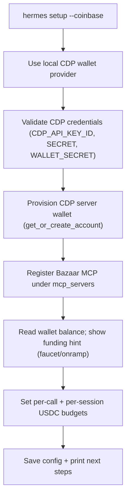

# Onboarding walkthrough: `hermes setup --coinbase`

This is the target experience the companion plugin enables. The `--coinbase` flag is a
thin upstream addition to Hermes that delegates to this package's
`run_x402_onboarding(config)` (the same code path as `hermes x402 init`).

## The flow



1. **Provider** — uses `local` (self-custodial CDP server wallet). Remote Coinbase MCP is
   future work and not selectable in this release.
2. **Credentials** — reads `CDP_API_KEY_ID`, `CDP_API_KEY_SECRET`, `CDP_WALLET_SECRET` from
   `~/.hermes/.env`. Prints specific instructions if any are missing; exits cleanly.
3. **Wallet** — calls `CdpClient().evm.get_or_create_account("hermes-x402")`. No new wallet
   is created if the account already exists.
4. **Register MCP servers** — writes `mcp_servers.bazaar` so the agent calls it natively
   (`mcp_bazaar_search_resources` to discover, `mcp_bazaar_proxy_tool_call` to invoke).
5. **Fund** — reads the wallet balance; prints `cdp_faucet` hint on testnet, `cdp_onramp`
   on mainnet. Check any time with `hermes x402 balance` or `/x402`.
6. **Budgets** — sets a per-call cap (`max_price_usdc`) and per-session ceiling
   (`session_budget_usdc`).
7. **Done** — config saved; the agent discovers via the Bazaar MCP, pays known HTTP URLs
   with `x402_request`, and pays for any `mcp_*` call with `x402_retry_mcp_payment`.

> Paying for **inference** via `provider: x402` is intentionally out of scope for now (it
> needs `upto` / `batch-settlement` schemes we are not implementing yet).

## Why a flag + companion (not a fork)

Only the `--coinbase` flag lands upstream in Hermes; everything substantial (the CDP wallet
core, payment seam, `cdp_*` tools, onboarding) ships here as `hermes-x402`. That keeps the
upstream PR small while the integration depth lives in this repo.

## Equivalent manual path

```bash
pip install hermes-x402
# Add CDP credentials to ~/.hermes/.env:
#   CDP_API_KEY_ID=...
#   CDP_API_KEY_SECRET=...
#   CDP_WALLET_SECRET=...
# pip plugins must be listed in config manually:
# plugins:
#   enabled: [hermes-x402]
hermes x402 init        # same flow as hermes setup --coinbase
hermes x402 status      # verify wallet + balance
```
