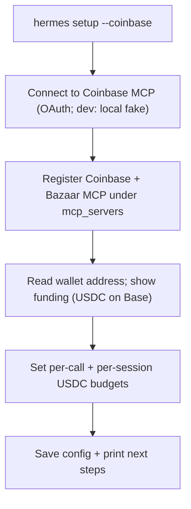

# Onboarding walkthrough: `hermes setup --coinbase`

This is the target experience the companion plugin enables. The `--coinbase` flag is a
thin upstream addition to Hermes that delegates to this package's
`run_x402_onboarding(config)` (the same code path as `hermes x402 init`).

## The flow



1. **Connect** — authorizes the **Coinbase MCP** (OAuth in prod; the local `fake-coinbase-mcp`
   over stdio in dev). The Coinbase MCP holds the wallet and signs payments; no key in the
   agent.
2. **Register MCP servers** — writes `mcp_servers.coinbase` and `mcp_servers.bazaar` so the
   agent calls them natively (`mcp_bazaar_search_resources` to discover,
   `mcp_bazaar_proxy_tool_call` to invoke).
3. **Fund** — reads the wallet address from the Coinbase MCP and shows instructions to send
   USDC on Base. Check balance any time with `hermes x402 balance` or `/x402`.
4. **Budgets** — sets a per-call cap (`max_price_usdc`) and per-session ceiling
   (`session_budget_usdc`).
5. **Done** — config saved; the agent discovers via the Bazaar MCP, pays known HTTP URLs
   with `x402_request`, and pays for any `mcp_*` call with `x402_retry_mcp_payment`.

> Paying for **inference** via `provider: x402` is intentionally out of scope for now (it
> needs `upto` / `batch-settlement` schemes we are not implementing yet).

## Why a flag + companion (not a fork)

Only the `--coinbase` flag lands upstream in Hermes; everything substantial (the Coinbase
MCP connection, payment seam, tools, onboarding) ships here as `hermes-x402`. The
signing wallet lives in the Coinbase MCP. That keeps the upstream PR small while the
integration depth lives in this repo.

## Equivalent manual path

```bash
pip install hermes-x402
pip install -e fake-coinbase-mcp   # dev signer (or configure the remote Coinbase MCP)
hermes plugins enable hermes-x402
hermes x402 init        # same flow as hermes setup --coinbase
hermes x402 status      # verify signer connection + wallet balance
```
