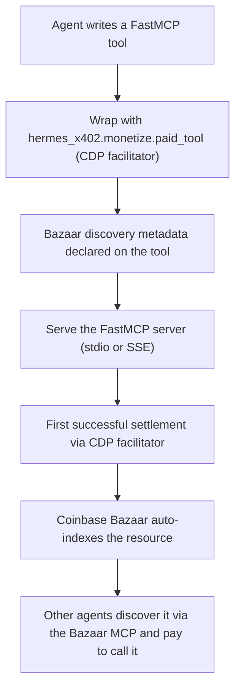

# Self-publish walkthrough: an agent monetizes its own endpoint

The stretch direction from the deal memo: an agent stands up a paid x402 endpoint and
makes it discoverable, so other agents can pay to use it.

## Flow



## Steps

1. Write the tool and wrap it (see `examples/monetize_endpoint.py`):

```python
from hermes_x402.monetize import paid_tool

charge = paid_tool(pay_to="0xYourWallet", price_usdc="0.01",
                   resource_url="mcp://tool/get_weather")

@mcp.tool(name="get_weather")
@charge
async def get_weather(city: str) -> str:
    ...
```

2. Run the server and route payments through the **CDP facilitator**
   (`https://api.cdp.coinbase.com/platform/v2/x402`) using your `CDP_API_KEY_ID` /
   `CDP_API_KEY_SECRET`. Settlement lands USDC at `pay_to`.

3. After one successful settlement, the resource is indexed in the Coinbase Bazaar.
   Buyers find it natively via the Bazaar MCP (`mcp_bazaar_search_resources` →
   `mcp_bazaar_proxy_tool_call`) and pay with `x402_retry_mcp_payment`, or via
   `x402_request` if it's a plain HTTP endpoint.

## Why this composes

The CDP facilitator config (`hermes_x402.facilitator.facilitator_config`) powers
**monetization** (verify/settle), while buyers discover through the native Bazaar MCP. The
Coinbase MCP
signs outgoing payments and reports the wallet address used as the **payout target**
(`monetize.paid_tool` defaults `pay_to` to it). An agent can therefore be both a buyer and a
seller in the x402 economy with a single custodial wallet behind the Coinbase MCP.
